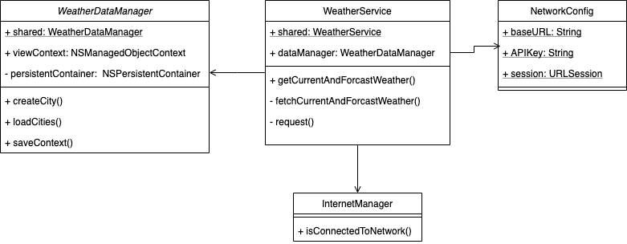

# WeatherApi

## 1. Installation: 
1. Après avoir téléchargé le framework, dézippez et placez le au même niveau que votre application.
1. créer un podFile dans votre application: 
```
pod init
```
2. ouvre votre podFile et ajouter la ligne suivante:
```
pod 'WeatherApi' , :path=> '../WeatherApi'
```
3. sauvegardez votre fichier, en suite installez le framework:
```
pod install
```
## 2. Diagramme de classe:



## 3. Diagramme de class métier:


